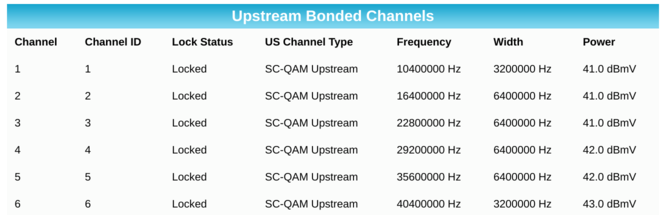

arris-scrape will read from Arris's modem web page and output Prometheus-style
metrics as a one-shot or as a server.

Tested only on an Arris SURFboard SB8200.

To use:

```
go install stevenandbonnie.com/arris-scrape@latest
arris-scrape -passwd $PASSWD
```

Downstream metrics:

1. `downstream_bonded_channels_frequency_hz`
1. `downstream_bonded_channels_power_dbmv`
1. `downstream_bonded_channels_snr_mer_db`
1. `downstream_bonded_channels_corrected`
1. `downstream_bonded_channels_uncorrectables`


Upstream metrics:

1. `upstream_bonded_channels_frequency_hz`
1. `upstream_bonded_channels_width_hz`
1. `upstream_bonded_channels_power_dbmv`



It's intended to be run repeatedly by another tool. For example, for Telegraf:

```
[[inputs.exec]]
  name_override = "modem"
  commands = ["arris-scrape -passwd 'my password'"]
  data_format = "prometheus"
  interval = "60s"
  timeout = "30s"
```

Pass in a flag like `-http-addr=:5000` to run in server mode.
